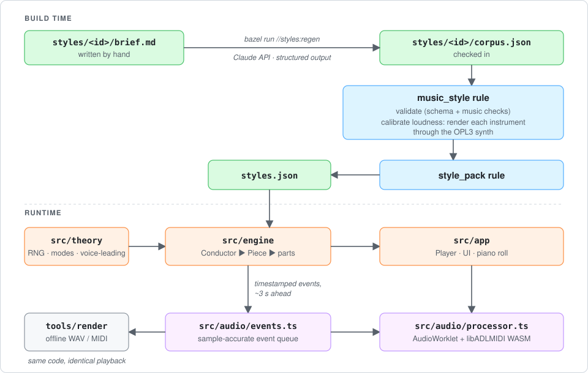

# Mindless Midi

Endless background music in a browser tab. Pick one or more styles (Metroid
Vibes, Retro Games, Lo-fi Hip Hop, Jazz Piano Trio, Minimalist Piano, Monkey
Island Vibes, Electro Swing, Synthwave, Bossa Nova, 70s Funk, Spaghetti
Western, Celtic Tavern, Café Musette, Liquid Drum & Bass, Castlevania Vibes,
16-bit JRPG) and it plays forever, never repeating,
without streaming anything: every note is arranged and synthesized live in the
page.

**Live:** https://jastice.github.io/mindless-midi/

- **LLM-seeded.** At build time Claude writes each style's *corpus*: chord
  progressions, motifs, bass and arpeggio ostinatos, comping rhythms, drum
  grooves, song forms, instrumentation. The corpora are checked in, so builds
  are hermetic and need no API key.
- **Algorithmically arranged.** In the browser, a seeded arranger picks key,
  tempo and form for each piece, binds material to sections, develops lead
  motifs (sequence, inversion, mutation, cadences), voice-leads the chords,
  swings and humanizes, and rotates between your selected styles.
- **Played on an FM chip, or not.** By default notes go to [libADLMIDI](https://github.com/Wohlstand/libADLMIDI)
  (Nuked OPL3 emulation, WebAssembly) in an AudioWorklet, with sample-accurate
  timing. Each style uses a classic DOS-era FM patch bank. The **Sound** chips
  switch to three other engines that render per-instrument stems in a worker
  and mix them through a per-style studio bus (reverb, echo, ducking, tape):
  *FM + studio* (the same chip, one stem per instrument), *Synth* (modelled
  instruments, nothing to download) and *Samples* (recorded instruments,
  streamed on demand).
- **Bazel all the way.** Corpus validation, loudness calibration, bundling, the
  static site, the dev server and deployment are all Bazel targets.

## Quick start

Requires [Bazelisk](https://github.com/bazelbuild/bazelisk) (Bazel 9.2 is pinned
in `.bazelversion`). Everything else, including Node, is fetched by Bazel.

```bash
bazel run //site:serve
```

Then open http://localhost:8080. Other entry points:

```bash
bazel test //...
```

```bash
bazel build //site
```

```bash
bazel run //tools/render -- --styles lofi,jazz_trio --seconds 120 --out /tmp/mix.wav --midi /tmp/mix.mid
```

In the page: <kbd>Space</kbd> plays/pauses, <kbd>N</kbd> or <kbd>→</kbd> skips
to a new piece, and **⤓ MIDI** downloads the last 10 minutes as a `.mid`. The URL
carries the seed, style selection and sound engine, so a link reproduces the same music.

### Synthesis bench

```bash
bazel run //src/bench:serve
```

A separate app (http://localhost:8090) that renders one score through every
engine offline (FM as shipped, FM through the bus, synths, samples, and an
experimental Magenta DDSP neural lead), loudness-matches them and lets you A/B
them at the same playhead, blind if you like, with per-instrument solos and a
spectrogram. CI deploys it to its own Cloudflare Pages project (see
Deploying); `bazel run //src/bench:deploy` publishes it to a `bench-pages`
branch by hand instead.
Media keys work through the Media Session API.

## How it fits together



- `src/theory`: seeded RNG, modes, roman-numeral chord parsing, chord-scales,
  voice-leading.
- `src/corpus`: the corpus schema (zod). Its field descriptions double as the
  generation instructions sent to Claude. Also the validator. Forms can be
  *areas* (e.g. Metroid's Crateria, Brinstar, Norfair, Maridia, Wrecked Ship)
  with their own tempo, keys and instrument swaps, using material tagged with
  the same palette.
- `src/engine`: `Conductor` strings pieces together forever; `Piece` plans one
  piece (key, tempo, form, repeats, orchestration changes) and renders it bar by
  bar; `parts.ts` writes drums, ostinatos, chords and developed melodies. It is
  deterministic: the same seed gives the same music.
- `src/audio`: the sample-accurate event queue, the output leveler (calibrated
  style gain, slow ±6 dB auto-gain, soft limiter) and the AudioWorklet
  processor. Scheduling is driven by ticks from the audio thread rather than
  timers, so playback keeps going in background tabs.
- `src/sound`: the other engines. DSP voices (modal piano, FM e-piano,
  Karplus-Strong, PolyBLEP subtractive, analog kit), the sampler (SFZ and GM
  soundfont instruments, per-style drum kits), the schedulable mix bus, the
  render worker and the stem worklet.
- `src/bench`: the synthesis bench.
- `src/app`: the page.
- `tools/generate`: regenerates corpora with Claude.
- `tools/stylec`: the build-time style compiler used by the rules.
- `tools/render`: offline WAV/MIDI rendering and loudness calibration (Node + the same WASM synth).
- `tools/social`: the link-preview card; `tools/social/render.sh` re-renders `src/app/social.png` (headless Chrome) after you edit `card.html`.
- `site`: assembles the static site; dev server; deploy target.

## Bazel rules

Custom rules live in `bazel/`:

| Rule / macro | File | What it does |
| --- | --- | --- |
| `music_style` | `bazel/music.bzl` | Validates a corpus (an invalid corpus fails the build), binds the FM bank and UI colour, and calibrates per-instrument CC7 levels plus a style gain by rendering through the synth. `--output_groups=+calibration` emits a report. |
| `style_pack` | `bazel/music.bzl` | Merges styles into the `styles.json` the app fetches. |
| `gh_pages_deploy` | `bazel/deploy.bzl` | `bazel run` target that commits the built site to a branch and pushes it. |
| `stamp_build_info` | `bazel/stamp.bzl` | Fills the footer's build line (commit hash linked to GitHub) from workspace status. Needs `--config=stamp`. |
| `ts_lib`, `ts_test`, `ts_binary` | `bazel/ts.bzl` | Repo conventions over rules_ts/rules_js (browser vs Node tsconfig, `node:test` tests). |

Third-party rules: `aspect_rules_js`, `aspect_rules_ts`, `aspect_rules_esbuild`,
`bazel_lib`, `rules_nodejs`.

## Regenerating a style with Claude

```bash
bazel run //styles:regen -- styles/metroid
```

This sends `styles/metroid/brief.md` to Claude (`claude-opus-5-5`, adaptive
thinking, structured JSON output against the corpus schema), runs the same
validator the build uses, feeds any errors back for up to two repair rounds,
and overwrites `styles/metroid/corpus.json`. Several directories can be passed
at once. Credentials come from `ANTHROPIC_API_KEY` or an `ant auth login`
profile. Use `--dry-run` to print the prompts without calling the API, and
`--model <id>` to pick another model. Review the diff, rebuild (which
re-calibrates loudness), listen, commit.

The corpora currently checked in were written by Claude (Opus 5.5) directly
during development rather than through this tool. Running the tool replaces
them with API-generated ones.

### Adding a style

1. Create `styles/<id>/brief.md` describing the music.
2. Run `bazel run //styles:regen -- styles/<id>`.
3. Add `styles/<id>/BUILD.bazel` (copy another style's) and pick an FM `bank`
   (libADLMIDI embedded bank number; e.g. 1 = Bisqwit, 14 = Doom's Bobby
   Prince set, 58 = The Fat Man, 68 = Nguyen/Wohlstand 4-op GM, 72 = DMXOPL3)
   and a `color`. Check the calibration report
   (`bazel build //styles/<id>:style --output_groups=+calibration`): an
   instrument stuck at CC7 127 is too quiet in that bank.
4. Add the id to `STYLES` in `styles/BUILD.bazel`.

## Deploying

The workflow in `.github/workflows/pages.yml` runs `bazel test //...` and
`bazel build --config=stamp //site` on every push and PR, and publishes to GitHub Pages from
`main`. One-time setup after pushing the repo: **Settings → Pages → Source:
GitHub Actions**.

`.github/workflows/cloudflare.yml` is an alternative target: it builds `//site`
and deploys to Cloudflare Pages (production from `main`, a preview URL per
same-repo PR). It does nothing until you set it up once:

1. Create the project: `npx wrangler pages project create <name>
   --production-branch main` (or Workers & Pages → Create → Pages → Direct
   Upload in the dashboard).
2. Create an API token with the **Cloudflare Pages: Edit** permission, and note
   your account ID.
3. In the GitHub repo, add secrets `CLOUDFLARE_API_TOKEN` and
   `CLOUDFLARE_ACCOUNT_ID`, and the variable `CLOUDFLARE_PAGES_PROJECT=<name>`.
4. Optional: enable Web Analytics for the project in the Cloudflare dashboard
   (cookieless, no consent banner needed).

The same workflow deploys the synthesis bench (`//src/bench:site`) as a
separate Pages project, `<project>-bench`, which it creates on first run.

To publish by hand to a `gh-pages` branch instead:

```bash
bazel run --config=stamp //site:deploy -- --dry-run
```

`--config=stamp` bakes the commit hash into the footer; without it the build
line is left out. Drop `--dry-run` to push. The site is fully static and uses relative URLs, so
it works from any sub-path or static host. It needs a secure context (HTTPS or
localhost) for AudioWorklet.

## Notes

- Synthesis uses 4 emulated OPL3 chips (72 two-operator voices) with Nuked OPL3,
  at roughly 4% of one CPU core. Offline it renders about 25x faster than
  realtime.
- Licensing: this project is [MIT](LICENSE). The bundled synth is not:
  libadlmidi-js is LGPL-3.0, and upstream libADLMIDI mixes GPL and LGPL by
  component (only the Nuked OPL3 profile is bundled here).
- The Samples engine streams from [danigb/samples](https://github.com/danigb/samples)
  and [gleitz/midi-js-soundfonts](https://github.com/gleitz/midi-js-soundfonts)
  at runtime (nothing is bundled): Splendid Grand Piano (public domain), VCSL
  (CC0), D. Smolken double bass (CC0), Greg Sullivan's Wurlitzer (CC BY 3.0),
  MusyngKite (CC BY-SA 3.0), plus drum-machine and Sonic Pi kits. The page
  credits whatever it has played. The bench additionally loads the Magenta
  DDSP checkpoints (Apache 2.0).
- Dev console: `mindlessMidi.player` and `mindlessMidi.styles` are exposed for tinkering.
